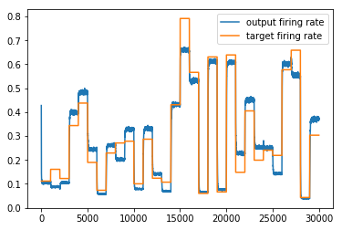
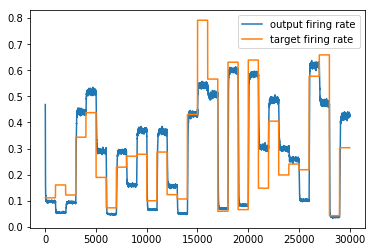

# Dendritic error backpropagation

A third-party reimplementation of the paper: *"Dendritic error backpropagation in deep cortical microcircuits"* by João Sacramento, Rui Ponte Costa, Yoshua Bengio and Walter Senn.

[https://arxiv.org/abs/1801.00062](https://arxiv.org/abs/1801.00062)

## Result

### Non-linear associative task

Firing rate of the final layer with target signal inputs after the training.

Firing rate of the final layer without target signal inputs after the training.

